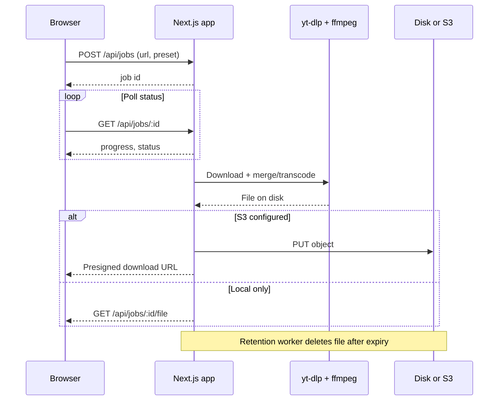

# Pluck

A small, self-hosted media downloader: paste a link, pick a format, and save the file. No accounts, no queue UI beyond a single job at a time.

Built as a TypeScript monorepo around **yt-dlp** and **ffmpeg**—background jobs, optional object storage for finished files, and automatic cleanup after a retention window.

## What it does

Someone opens the app, pastes a supported URL, and chooses **1080p**, **720p**, **480p** (MP4), or **Music only** (MP3). Pluck downloads the media in the background and shows progress on the button. When it finishes, they click **Save to my computer** to download the file.

Finished files are removed automatically after a configurable retention period (default **12 hours**). Optionally, the whole app can be protected with a shared password for household use.

## How it works (high level)



The app spawns **yt-dlp** as a child process and tracks progress from its output. It does not proxy media through the API during download—only serves (or presigns) the finished file.

## Technical highlights

| Area | Approach |
|------|----------|
| **Download engine** | yt-dlp with ffmpeg for merge/transcode; format presets in shared app code |
| **Jobs** | In-memory job state on a single instance; poll-based progress in the UI |
| **Finished files** | Local temp dir by default, or upload to any S3-compatible bucket |
| **Retention** | Manifest on disk + background worker (no Redis on a single node) |
| **Auth** | Optional shared secret via `APP_PASSWORD` and `x-pluck-password` header |
| **Deployment** | Single Docker image (Node + Python + yt-dlp + ffmpeg) or local Bun dev |

## Stack

- **Monorepo** — Turborepo, Bun workspaces
- **Web** — Next.js, React, Tailwind, shared UI package
- **Runtime tools** — yt-dlp, ffmpeg (required on PATH or in the container image)
- **Storage** — Local `DOWNLOAD_DIR` or S3-compatible object storage (optional)
- **Language** — TypeScript throughout

## Repository layout

```
apps/
  web/       Next.js app: downloader UI, API routes, retention worker
  raycast/   Raycast command: download from active browser tab → ~/Downloads
packages/
  ui/        Reusable UI components (shadcn-style)
  eslint-config/
  typescript-config/
```

## Try it locally

Requires [Bun](https://bun.sh), **yt-dlp**, and **ffmpeg** on your PATH.

```bash
bun install
cp .env.example .env
bun run dev --filter=web
```

Open http://localhost:3000.

Without S3 configured, finished files are served from the app (`DOWNLOAD_DIR`, default `/tmp/pluck`).

### Docker

Copy env first (Compose loads `.env` into the container; secrets stay out of `docker-compose.yml`):

```bash
cp .env.example .env
docker compose up --build
```

Health check: `GET /api/health` (verifies yt-dlp and ffmpeg).

Optional MinIO for S3 testing: set `MINIO_ROOT_USER` and `MINIO_ROOT_PASSWORD` in `.env`, then `docker compose --profile storage up -d`.

### Environment

See [.env.example](.env.example). Common variables:

| Variable | Purpose |
|----------|---------|
| `DOWNLOAD_DIR` | Temp folder for yt-dlp output |
| `RETENTION_HOURS` | Auto-delete finished files after this many hours |
| `APP_PASSWORD` | Optional shared secret for the UI / API |
| `S3_*` | Upload finished files and return a download link |

Respect site terms and copyright. Built for personal and household use.
